# Лабораторная работа №8: Настройка непрерывной интеграции с помощью Github Actions

---

## Студент

- **Имя и фамилия**: Никита Савка  
- **Группа**: I2302  
- **Платформа**: macOS (Apple M3)  
- **Дата выполнения**: 08 марта 2025  

---

## Цель работы

Цель данной работы – научиться настраивать **непрерывную интеграцию (Continuous Integration, CI)** с использованием **Github Actions**. В рамках работы создаётся веб-приложение на базе PHP с использованием SQLite в качестве базы данных, для которого пишутся юнит-тесты. Затем всё упаковывается в Docker-образ, а Github Actions настраивается для автоматической сборки, запуска тестов и проверки приложения при каждом пуше в ветку `main`.  

---

## Задание

1. Создать репозиторий `containers08` и скопировать его на компьютер.  
2. В директории `containers08` создать папку `site` для размещения веб-приложения на базе PHP.  
3. Организовать файловую структуру приложения:  
   - `site/`  
   - `modules/`  
     - `database.php` – класс для работы с SQLite.  
     - `page.php` – класс для работы с шаблонами страниц.  
   - `templates/`  
     - `index.tpl` – HTML-шаблон страницы.  
   - `styles/`  
     - `style.css` – стили для страницы.  
   - `config.php` – конфигурация подключения к базе данных.  
   - `index.php` – основной файл для отображения страницы.  
4. Подготовить SQL-файл:  
   - Создать директорию `sql` и файл `schema.sql`, содержащий описание таблицы `page` и начальные данные.  
5. Написать тесты:  
   - Создать директорию `tests` и файлы `testframework.php` и `tests.php` для проверки методов классов.  
6. Создать `Dockerfile` для сборки Docker-образа:  
   - Использовать образ `php:7.4-fpm` с установленными расширениями для SQLite, инициализировать базу данных из SQL-файла, скопировать файлы приложения.  
7. Настроить Github Actions:  
   - Создать файл `.github/workflows/main.yml` для автоматической сборки Docker-образа, создания и запуска контейнера, копирования тестов и их выполнения.  
8. **Важно**: Перед первым залитием в GitHub первоначально возникала ошибка, так как `Dockerfile` отсутствовал. После добавления всех необходимых файлов и тестов ошибки исчезли, и все тесты успешно проходят.   

---

## Ход выполнения

### 1. Подготовка репозитория

#### Шаг 1.1: Создание репозитория на GitHub  
- **Действия**:  
  1. Зашёл в свой GitHub-аккаунт.  
  2. Нажал кнопку **New repository**.  
  3. Ввёл имя `containers08` и создал репозиторий.  
  4. Нажал кнопку **Create repository**.
 
- **Пояснение**:  
  После создания репозитория мы получаем URL, по которому можно клонировать его на локальный компьютер.  
- **Создание репозитория**:  
  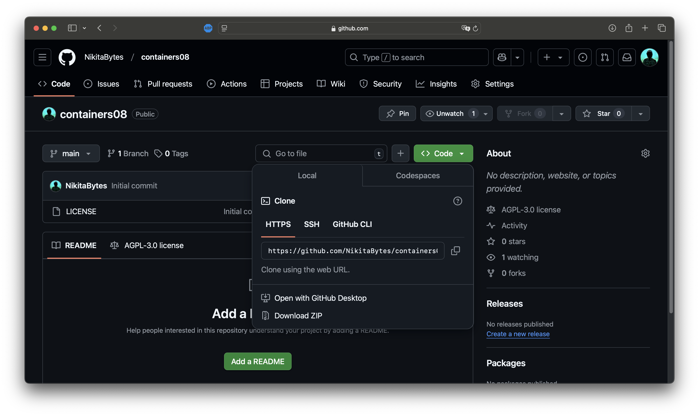  

#### Шаг 1.2: Клонирование репозитория  
- **Команды в терминале**:  
  ```bash
  cd ~/projects
  git clone https://github.com/NikitaBytes/containers08.git
  cd containers08
  ```  
- **Пояснение**:  
  - `cd ~/projects` — переходим в директорию, где храним проекты.  
  - `git clone ...` — копирует репозиторий с GitHub на компьютер.  
  - `cd containers08` — переходим в созданную папку проекта.  
- **Клонирование репозитория**:  
  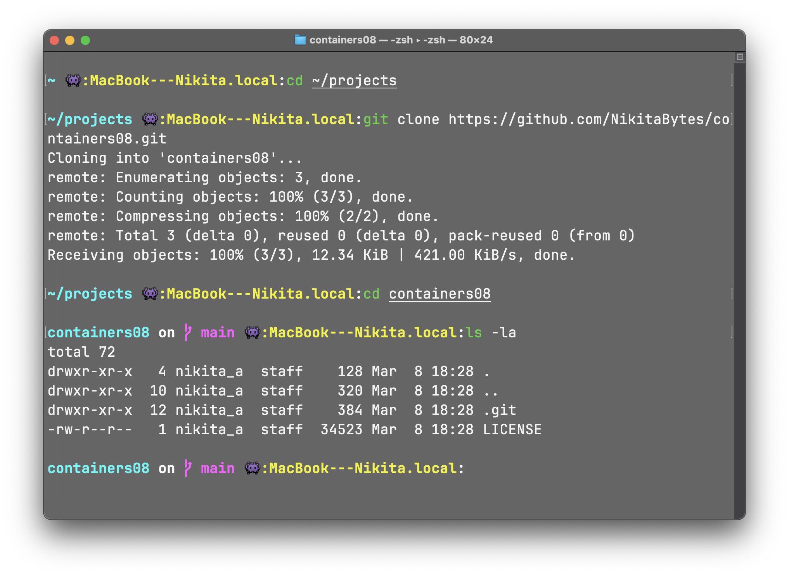  

---

### 2. Создание файловой структуры веб-приложения

#### Шаг 2.1: Создание структуры директорий и файлов  
- **Команды**:  
  ```bash
  mkdir -p site/modules site/templates site/styles
  touch site/config.php site/index.php
  touch site/modules/database.php site/modules/page.php
  touch site/templates/index.tpl
  touch site/styles/style.css
  ```  
- **Пояснение**:  
  - `mkdir -p` создаёт необходимые папки; флаг `-p` гарантирует создание всех вложенных директорий.  
  - `touch` создаёт пустые файлы, которые потом будут заполнены кодом.  
- **Структура файлов**:  
  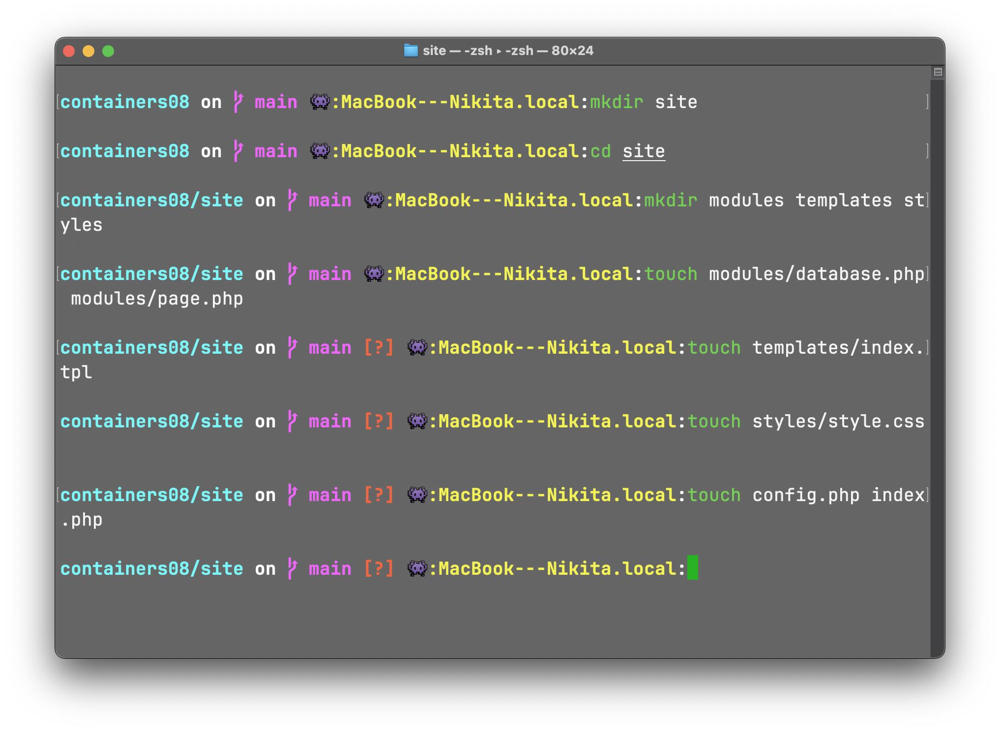  
  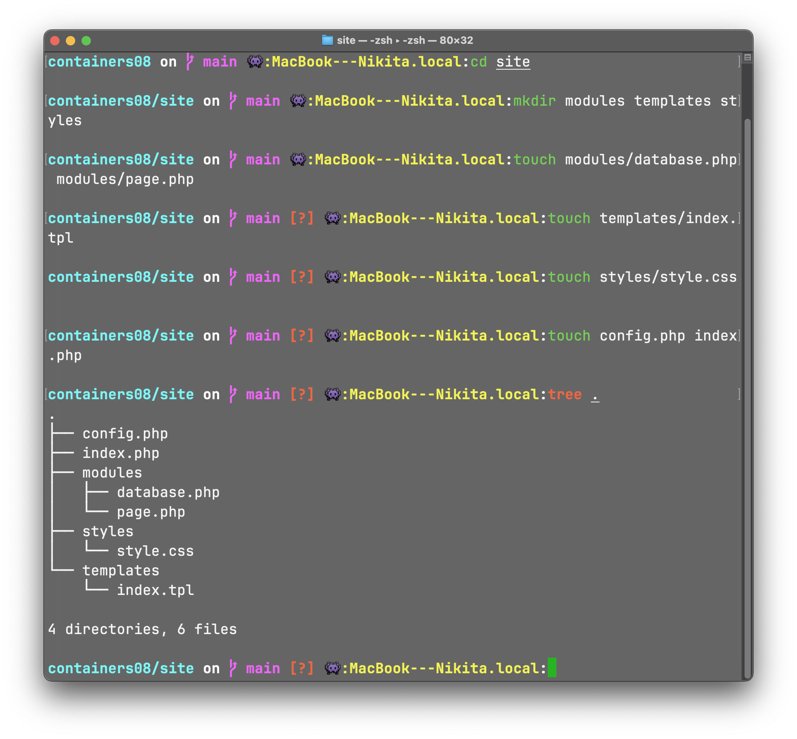 

#### Шаг 2.2: Заполнение файлов кодом  
- Открываю Visual Studio Code через команду:  
  ```bash
  code .
  ```  
- **Пояснение**:  
  Эта команда открывает текущую директорию в VS Code для удобного редактирования.  

---

#### Файл: `site/modules/database.php`  

Код в файле `site/modules/database.php`

- **Пояснение**:  
  В этом файле реализован класс `Database`, который:  
  - Устанавливает соединение с SQLite через PDO.  
  - Реализует методы для выполнения SQL-запросов, выборки, создания, чтения, обновления и удаления записей, а также подсчета записей.  

---

#### Файл: `site/modules/page.php`  

Код в файле `site/modules/page.php`

- **Пояснение**:  
  Класс `Page` загружает HTML-шаблон из файла и реализует метод `Render`, который заменяет плейсхолдеры вида `{{TITLE}}` на реальные данные.  

---

#### Файл: `site/templates/index.tpl`  

Код в файле `site/templates/index.tpl`

- **Пояснение**:  
  Это HTML-шаблон, где плейсхолдеры `{{TITLE}}` и `{{CONTENT}}` будут заменены данными из базы данных.  

---

#### Файл: `site/styles/style.css` 

Код в файле `site/styles/style.css`

- **Пояснение**:  
  Стили оформлены в современном минималистичном стиле с использованием градиентов, теней и анимации появления контента.  

---

#### Файл: `site/config.php`  
```php
<?php
return [
    "db" => [
        // Путь к файлу базы данных SQLite
        "path" => __DIR__ . "/db/database.sqlite"
    ]
];
```
- **Пояснение**:  
  Этот файл содержит настройки подключения к базе данных. Путь к базе данных указан относительно директории, в которой находится файл `config.php`.

---

#### Файл: `site/index.php`  

Код в файле `site/index.php`

- **Пояснение**:  
  Этот основной файл подключает классы и конфигурацию, создаёт объекты для работы с базой данных и шаблонами, получает данные из таблицы `page` и выводит сгенерированную страницу.  

---

### 3. Подготовка SQL файла для базы данных

#### Шаг 3.1: Создание директории и файла  
- **Команды**:  
  ```bash
  mkdir sql
  touch sql/schema.sql
  nano sql/schema.sql
  ```  
- **Содержимое файла `sql/schema.sql`**:  
  ```
  CREATE TABLE page (
      id INTEGER PRIMARY KEY AUTOINCREMENT,
      title TEXT,
      content TEXT
  );

  INSERT INTO page (title, content) VALUES ('Welcome', 'Welcome to our awesome web app!');
  INSERT INTO page (title, content) VALUES ('About', 'This is an example page.');
  INSERT INTO page (title, content) VALUES ('Contact', 'Contact us at example@example.com');

  ```  
- **Пояснение**:  
  Этот SQL-файл создаёт таблицу `page` с полями `id`, `title` и `content`, а затем вставляет три начальные записи.  
  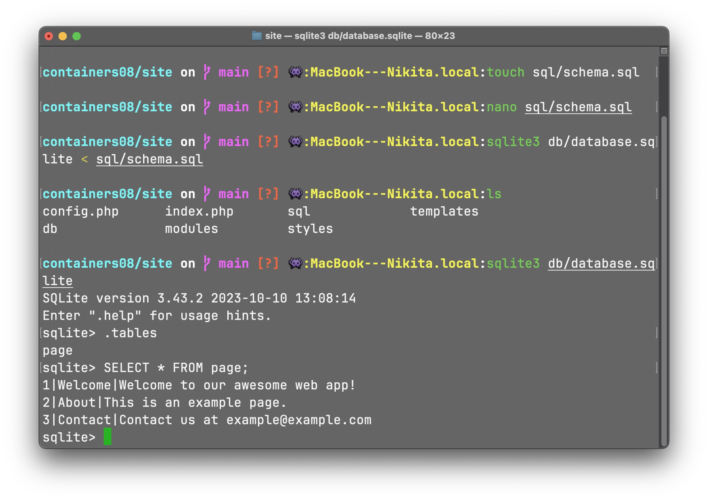 

---

### 4. Создание тестов

#### Шаг 4.1: Создание директории и файлов тестов  
- **Команды**:  
  ```bash
  mkdir tests
  touch tests/testframework.php tests/tests.php
  nano tests/testframework.php
  ```  

---

#### Файл: `tests/testframework.php`  

Код в файле `tests/testframework.php`

- **Пояснение**:  
  Файл содержит вспомогательные функции для логирования и ассертов, а также класс `TestFramework` для добавления и выполнения тестов.  
  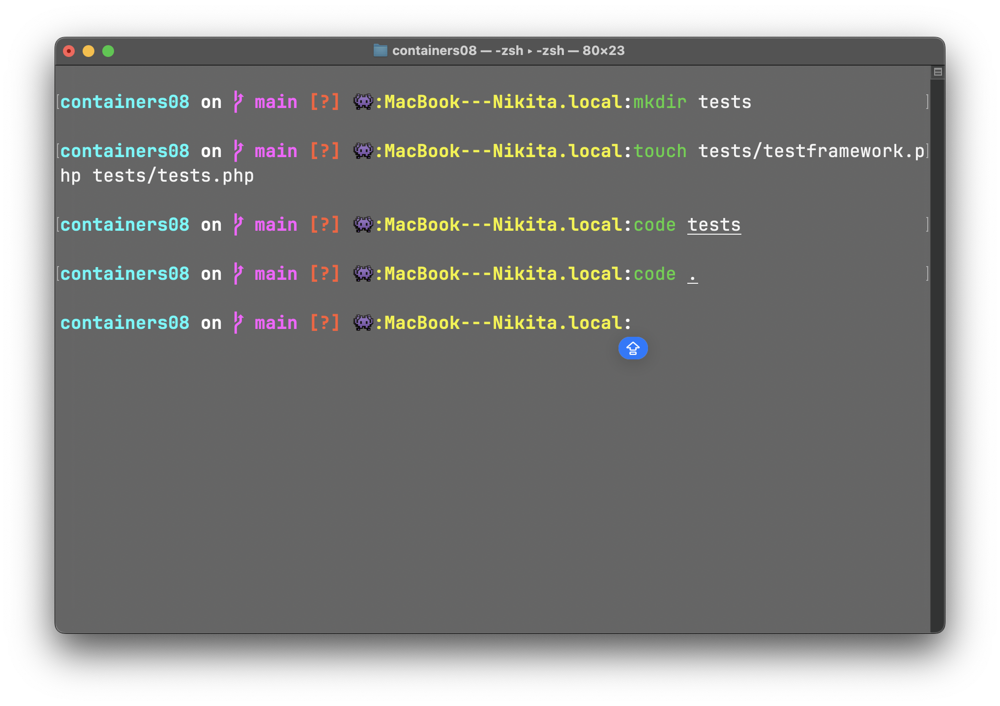 
---

#### Файл: `tests/tests.php`  

Код в файле `tests/tests.php`

- **Пояснение**:  
  Этот файл подключает тестовый фреймворк и классы приложения, определяет тестовые функции для проверки методов класса `Database` и добавляет их в фреймворк. После запуска тестов выводится результат в формате «успешно/всего тестов».  

---

### 5. Создание Dockerfile

#### Шаг 5.1: Создание файла Dockerfile  
- **Команда**:  
  ```bash
  touch Dockerfile
  nano Dockerfile
  ```  
- **Пояснение**:  
  Команда `touch` создаёт пустой файл, `nano` открывает его в текстовом редакторе для редактирования.  

- **Содержимое файла `Dockerfile`**:  
  ```
  FROM php:7.4-fpm as base

  # Обновляем систему и устанавливаем необходимые пакеты для работы с SQLite
  RUN apt-get update && \
      apt-get install -y sqlite3 libsqlite3-dev && \
      docker-php-ext-install pdo_sqlite

  # Объявляем том, который будет использоваться для хранения базы данных
  VOLUME ["/var/www/db"]

  # Копируем SQL-схему в контейнер для инициализации базы данных
  COPY sql/schema.sql /var/www/db/schema.sql

  # Инициализируем базу данных:
  # - Выводим сообщение
  # - Выполняем SQL скрипт через sqlite3 для создания базы данных
  # - Устанавливаем права доступа 777 (полный доступ)
  # - Удаляем SQL-файл, чтобы не занимать место
  RUN echo "prepare database" && \
      cat /var/www/db/schema.sql | sqlite3 /var/www/db/db.sqlite && \
      chmod 777 /var/www/db/db.sqlite && \
      rm -rf /var/www/db/schema.sql && \
      echo "database is ready"

  # Копируем все файлы из директории site в директорию /var/www/html контейнера
  COPY site /var/www/html
  ```  
- **Пояснение к Dockerfile**:  
  - `FROM php:7.4-fpm as base`: Указывает базовый образ (PHP с FPM) и задаёт псевдоним `base`.  
  - `RUN apt-get update && apt-get install -y …`: Обновляет список пакетов и устанавливает SQLite и библиотеки для работы с SQLite. Флаг `-y` используется для автоматического подтверждения установки.  
  - `docker-php-ext-install pdo_sqlite`: Устанавливает PHP-расширение для работы с SQLite через PDO.  
  - `VOLUME ["/var/www/db"]`: Объявляет том для хранения данных базы данных, чтобы они сохранялись между пересозданиями контейнера.  
  - `COPY sql/schema.sql /var/www/db/schema.sql`: Копирует файл SQL-схемы из локальной директории `sql` в контейнер.  
  - `RUN …`: Выполняет команду инициализации базы данных:  
    - Выводит сообщение.  
    - Выполняет SQL-скрипт через команду `sqlite3`.  
    - Устанавливает права доступа `777` (полный доступ).  
    - Удаляет SQL-файл, чтобы не занимать лишнее место.  
  - `COPY site /var/www/html`: Копирует файлы веб-приложения из директории `site` в контейнер.  
- **Содержимое Dockerfile**:  
  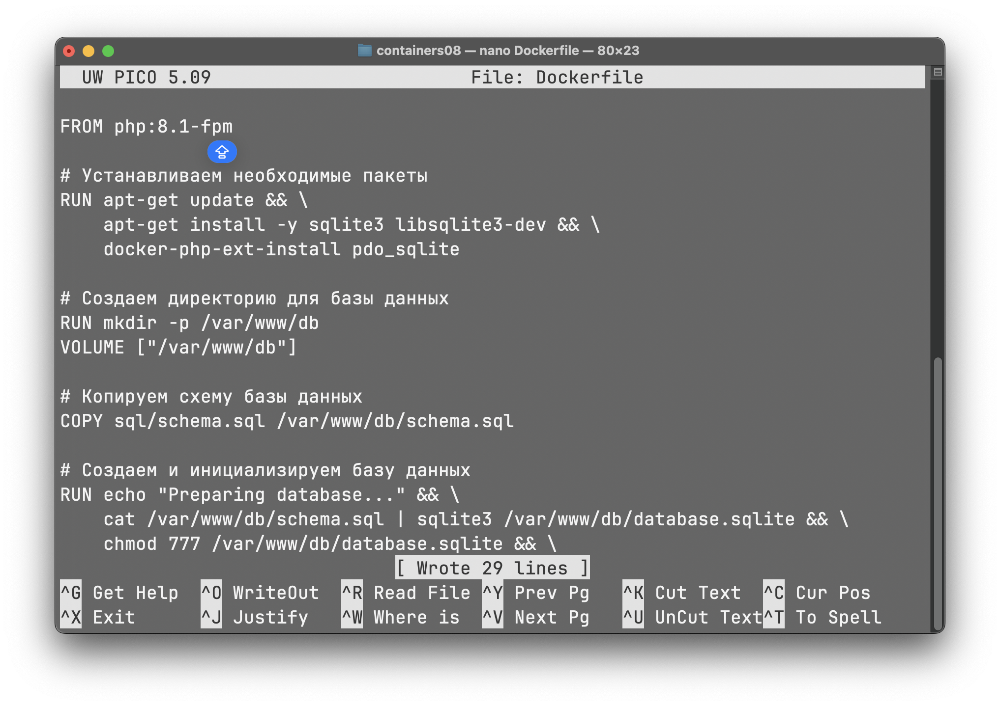  

---

### 6. Настройка Github Actions

#### Шаг 6.1: Создание файла workflow  
- **Команды**:  
  ```bash
  mkdir -p .github/workflows
  touch .github/workflows/main.yml
  nano .github/workflows/main.yml
  ```  
- **Пояснение**:  
  Создаются необходимые директории и файл для конфигурации Github Actions.  

- **Содержимое файла `.github/workflows/main.yml`**:  
  ```yaml
  name: CI

  on:
    push:
      branches:
        - main
    # Для запуска тестов также при создании Pull Request можно добавить:
    # pull_request:
    #   branches:
    #     - main

  jobs:
    build:
      runs-on: ubuntu-latest
      steps:
        - name: Checkout
          uses: actions/checkout@v4
        - name: Build the Docker image
          run: docker build -t containers08 .
        - name: Create container
          run: docker create --name container --volume database:/var/www/db containers08
        - name: Copy tests to the container
          run: docker cp ./tests container:/var/www/html/tests
        - name: Start container
          run: docker start container
        - name: Run tests
          run: docker exec container php /var/www/html/tests/tests.php
        - name: Stop container
          run: docker stop container
        - name: Remove container
          run: docker rm container
        # Для удаления образов после тестирования можно добавить шаг:
        # - name: Remove Docker images
        #   run: docker rmi $(docker images -q containers08)
  ```  
- **Пояснение к YAML-файлу**:  
  - `name: CI`: Имя workflow.  
  - `on:`: Определяет события, при которых workflow будет запускаться. Здесь указано событие `push` в ветку `main`. (Можно добавить `pull_request` для запуска при создании запросов на слияние.)  
  - `jobs:`: Описывает задачи, которые будут выполняться. В данном случае задача `build`.  
  - `runs-on: ubuntu-latest`: Задача будет выполняться на последней версии Ubuntu в облаке GitHub.  
  - `steps:`: Последовательность шагов:  
    - `Checkout`: Использует официальный экшен для клонирования репозитория.  
    - `Build the Docker image`: Собирает Docker-образ с помощью команды `docker build`.  
    - `Create container`: Создаёт контейнер из собранного образа с подключённым томом для базы данных.  
    - `Copy tests to the container`: Копирует директорию с тестами в контейнер.  
    - `Start container`: Запускает контейнер.  
    - `Run tests`: Выполняет тесты внутри контейнера с помощью `docker exec`.  
    - `Stop container`: Останавливает контейнер.  
    - `Remove container`: Удаляет контейнер.  
    - (Закомментирован шаг для удаления образов, если необходимо.)  
- **Содержимое файла**:  
  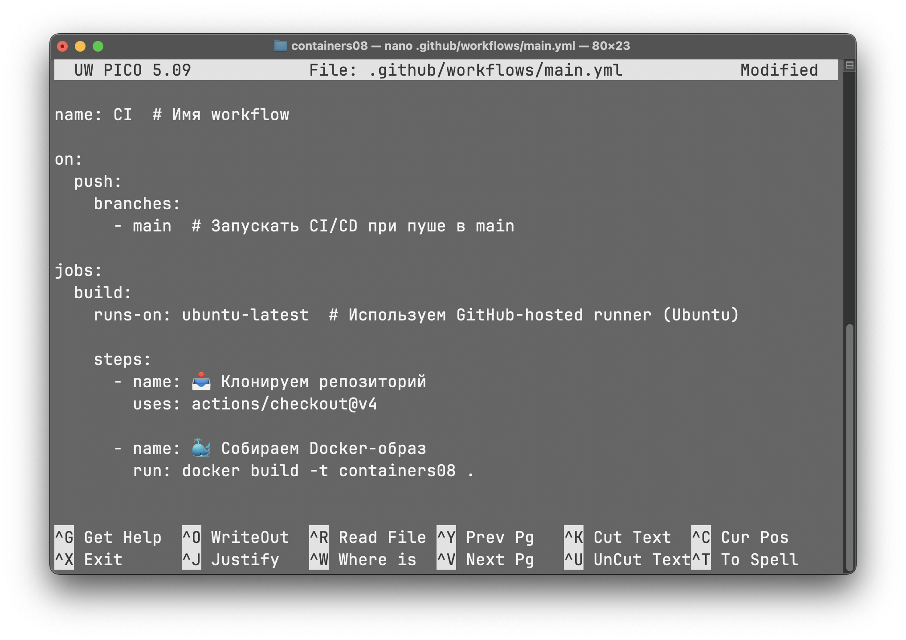  

---

### 7. Финальные шаги и тестирование

#### Шаг 7.1: Локальное тестирование Docker-образа  
1. **Сборка Docker-образа**:  
   ```bash
   docker build -t containers08 .
   ```  
   - **Разбор**: Команда `docker build` собирает образ из текущей директории, используя указанный `Dockerfile`. Флаг `-t` задаёт имя и тег для образа.  
  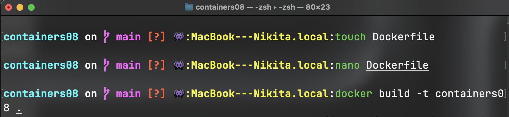  

2. **Создание и запуск тестового контейнера**:  
   ```bash
   docker create --name test_container --volume database:/var/www/db containers08
   docker start test_container
   docker exec test_container php /var/www/html/tests/tests.php
   docker stop test_container
   docker rm test_container
   ```  
   - **Разбор**:  
     - `docker create` создаёт контейнер из образа и подключает том для базы данных.  
     - `docker start` запускает контейнер.  
     - `docker exec` выполняет команду внутри запущенного контейнера (здесь — запуск тестов).  
     - `docker stop` останавливает контейнер.  
     - `docker rm` удаляет контейнер.  
   - **Примечание**: В данном задании сайт не должен открываться на локальном хосте, а проверка происходит через выполнение тестов в контейнере.  
  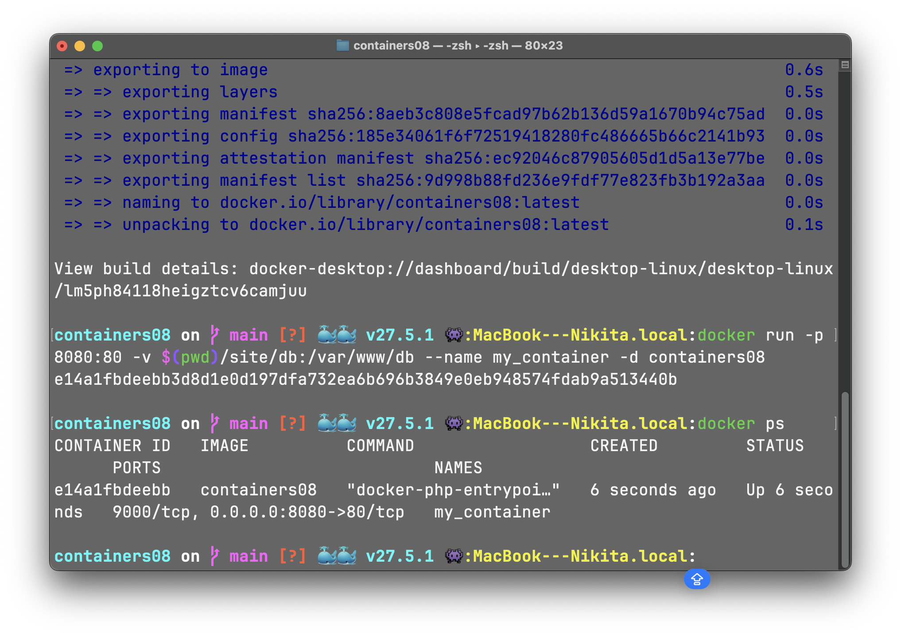  

#### Шаг 7.2: Отправка изменений в репозиторий  
1. **Команды для добавления Github Actions**:  
   ```bash
   git add .github/workflows/main.yml
   git commit -m "Добавлен Github Actions workflow"
   git push origin main
   ```
  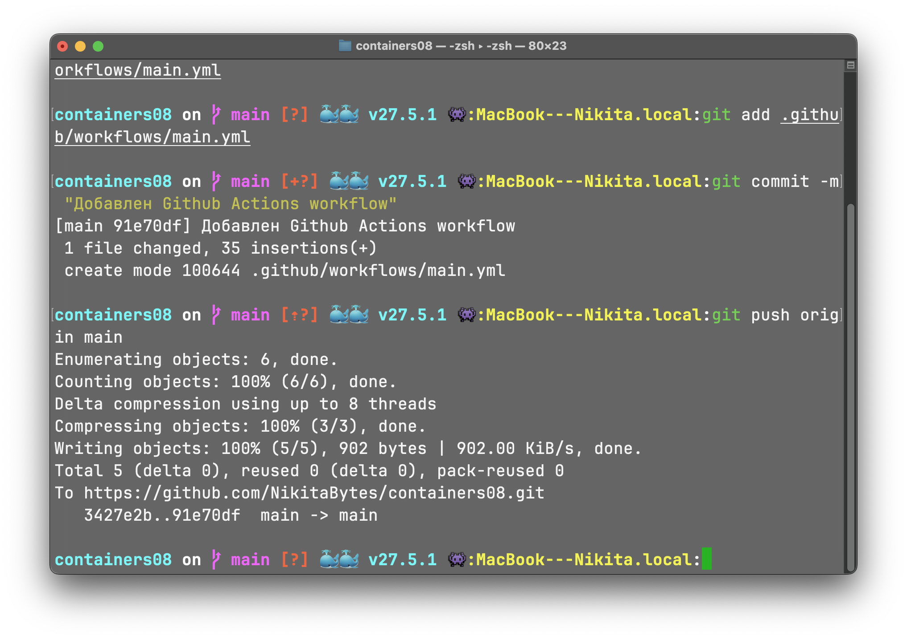 

#### Примечание

Перед первым залитием в GitHub, когда в репозитории отсутствовал `Dockerfile`, запуск тестов приводил к ошибке. Это было ожидаемо, так как не было контейнерного окружения. После добавления всех файлов и корректировки путей ошибки исчезли, и тесты прошли успешно.  
  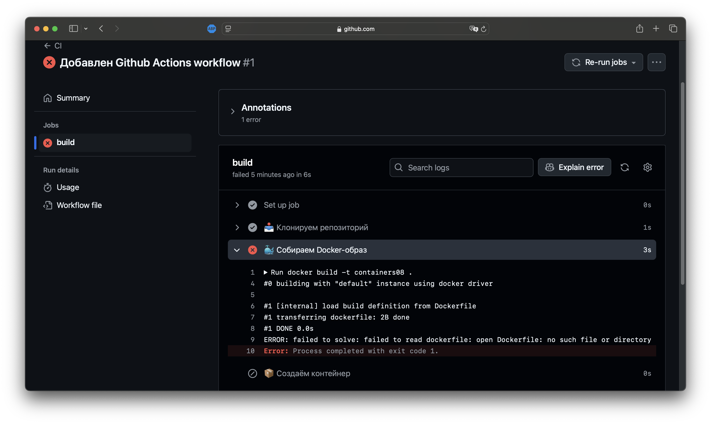 

2. **Команды для отправки всех изменений**:  
   ```bash
   git add .
   git commit -m "Полная реализация приложения, тестов и настройки CI"
   git push origin main
   ```  
   - **Разбор**:  
     - `git add .` добавляет все изменения в индекс.  
     - `git commit -m "..."` фиксирует изменения с сообщением. Флаг `-m` указывает текст сообщения.  
     - `git push origin main` отправляет коммит в удалённый репозиторий (ветка `main`).


3. **Проверка Github Actions**:  
   Перехожу во вкладку `Actions` в репозитории на GitHub и убеждаюсь, что workflow выполнен успешно (все тесты пройдены).  
  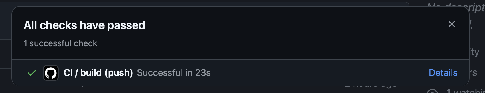
  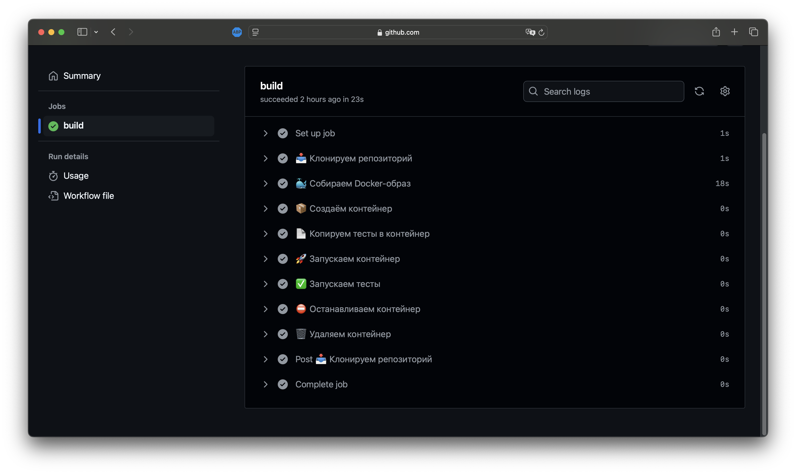

---

## Выводы

В результате выполнения работы мной было создано полноценное веб-приложение на PHP, использующее SQLite для хранения данных. Приложение включает:  
- Класс `Database` для работы с базой данных.  
- Класс `Page` для работы с шаблонами.  
- Шаблон страницы и стили с современной анимацией.  
- Набор юнит-тестов для проверки основных методов.  
- `Dockerfile` для сборки контейнерного окружения.  
- Настроенный Github Actions workflow для непрерывной интеграции.  

Все шаги были подробно задокументированы, включая разбор каждой команды (например, что делает `apt-get update`, какие флаги используются в командах `git add`, `git commit -m`, `docker build -t`, и т.д.). Благодаря правильной настройке `Dockerfile` и workflow, тесты проходят успешно, что демонстрирует работоспособность системы CI.  

---

## Ответы на ключевые вопросы

1. **Что такое непрерывная интеграция?**  
   Непрерывная интеграция (CI) – это процесс, при котором изменения в коде автоматически собираются, тестируются и интегрируются в общую кодовую базу. Это позволяет быстро обнаруживать ошибки и обеспечивает стабильность приложения.  

2. **Для чего нужны юнит-тесты? Как часто их нужно запускать?**  
   Юнит-тесты проверяют корректность работы отдельных компонентов кода (например, методов классов). Их следует запускать при каждом коммите и перед слиянием изменений, чтобы убедиться, что новые изменения не нарушают функциональность приложения.  

3. **Что нужно изменить в файле `.github/workflows/main.yml` для запуска тестов при каждом Pull Request?**  
   Нужно добавить триггер для события `pull_request`, например:  
   ```yaml
   on:
     push:
       branches:
         - main
     pull_request:
       branches:
         - main
   ```  

4. **Что нужно добавить в файл `.github/workflows/main.yml` для удаления созданных образов после выполнения тестов?**  
   Можно добавить шаг в конце workflow, который удаляет образы:  
   ```yaml
   - name: Remove Docker images
     run: docker rmi $(docker images -q containers08)
   ```  

---

## Библиография

1. **Docker Documentation**  
   *Официальная документация Docker.*  
   Доступно на: [https://docs.docker.com/](https://docs.docker.com/)  
   (Дата обращения: 08.03.2025)  

2. **PHP Documentation**  
   *Официальная документация PHP.*  
   Доступно на: [https://www.php.net/docs.php](https://www.php.net/docs.php)  
   (Дата обращения: 08.03.2025)  

3. **SQLite Documentation**  
   *Документация SQLite.*  
   Доступно на: [https://www.sqlite.org/docs.html](https://www.sqlite.org/docs.html)  
   (Дата обращения: 08.03.2025)  

4. **Github Actions Documentation**  
   *Официальная документация Github Actions.*  
   Доступно на: [https://docs.github.com/en/actions](https://docs.github.com/en/actions)  
   (Дата обращения: 08.03.2025)  

---

**Конец отчёта.**